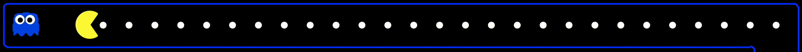
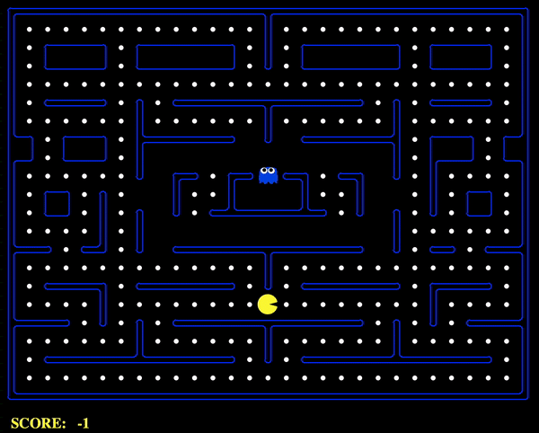
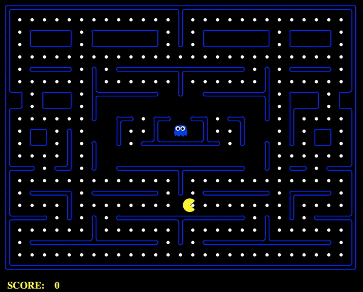
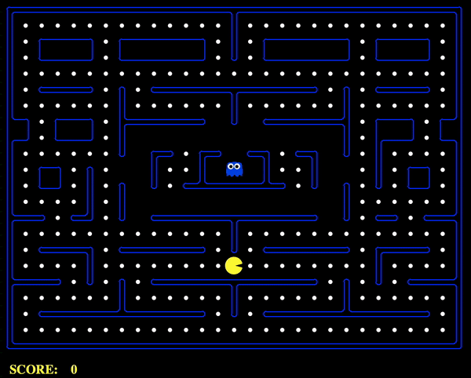

# PacNET
Are you bored of playing Pacman by yourself using your keyboard ? This ends now ! It is time for you to compare yourself against an AI ! Who will win ? Let's find out ! 🕹

## Illustration
|     PacHUMAN     | PacMAN | PacNET |
|:-:|:-:|:-:|
||||

**NOTE**

As of today, PacNET is still a work in progress since the results are not as good as the one obtained by PacMAN
## Installation

- First of all, it is **required** to install Python on your computer. If it is not already done, you can do it using the following [link](https://www.python.org/downloads/).

- Furthermore, it is needed to install the [*PyTorch*](https://pytorch.org) library as well as [*Numpy*](https://numpy.org). In order to do so, simply execute the command

```
pip3 install requirements.txt
```

Now, you should be setup ! 🎮

## Playing

Starting from the root of the folder, simply move to the src folder using the command:

```
cd src/
```

Then, if you want to start a game of Pacman, you should use the following syntax:

```
python3 run.py <game options>
```

where the options are:

```
# Define the agent that will be used to play as Pacman
--agentfile <agent> with <agent> = PacHUMAN.py (Human playing with arrow keys - DEFAULT)
                                   PacMAN.py   (AI playing using hminimax algorithm)
                                   PacNET.py   (AI playing using a convolutional neural network)
                                   
# Define the agent that will be used to play as the ghost
--ghostagent <agent> with <agent> = dumby      
                                    greedy     (DEFAULT)
                                    smarty     
                                    rightrandy

# Define the map that will be used to play the game
--layout <map> with <map> = map_1.lay (DEFAULT)
                            map_2.lay
                            map_3.lay
                            world_1.lay
                            world_2.lay
                         
# Define if the game window should not be displayed
--silentdisplay

# Define if the game should be used to retreive data for PacNET
--generate <int> with <int> = 0 (Not activated - DEFAULT)      
                              1

```

In order to illustrate how it works, here is an example of code line to run a game:
```
python3 run.py --agentfile PacMAN.py --ghostagent smarty --layout world_2.lay
```

## Generating data

If you want to start fresh with your data, you need first to delete all the files inside the *data* folder (x.txt & y.txt). Then,
starting from the root folder, use the command:

```
cd model/
```

Furthermore, you can modify the shell script *generate.sh* depending on your need (change map, change ghost type, change number of data created). Thus, you start by giving the permision to the script to work:

```
chmod 744 generate.sh
```

Finally, you can start generating some data using the command:

```
./generate.sh
```

## Training PacNET

Once the data is generated, you can simply start training PacNET using the command:

```
python3 train.py
```

**NOTE**
It is possible to change the architecture of PacNET inside the file *model/others/training.py*. If you change anything, do not forget to delete the former architecture of PacNET which can be easily found as *model/PacNETS/PacNET.pth*

## License
Attribution Information: The Pacman AI projects were developed at UC Berkeley.
The core projects and autograders were primarily created by John DeNero
(denero@cs.berkeley.edu) and Dan Klein (klein@cs.berkeley.edu).
Student side autograding was added by Brad Miller, Nick Hay, and
Pieter Abbeel (pabbeel@cs.berkeley.edu). It is important to understand that this project was achievable because of [**UC Berkeley**](http://ai.berkeley.edu)! All the credit goes to them ! 
